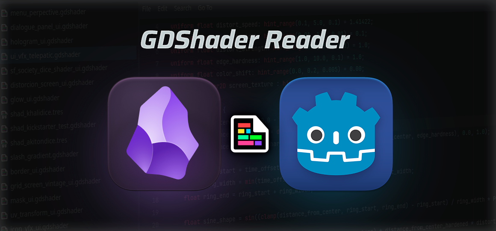
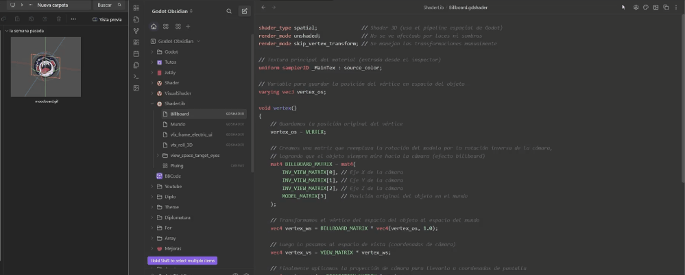

# GDShader Reader
A specialized Obsidian plugin for viewing Godot Engine `.gdshader` files with syntax highlighting and integrated visual references.

  
   
  <em>GLSL syntax with customizable themes</em>

## Features

### 📝 Shader Viewer
- Custom syntax highlighting for Godot shaders
- Highlights keywords, directives (`shader_type`, `render_mode`), built-ins, operators
- Line numbers and code selection

### 🎨 Customizable Themes
- 10 pre-built color presets (Argentina, Godot, Monokai, Dracula, Nord, etc.)
- 12 customizable color properties
- Quick theme selector in toolbar

  
   
  <em>Easily switch between color themes</em>

### 🖼️ Visual Reference Panel
- Attach **images or videos** as references for your shaders
- Supported formats: `png`, `jpg`, `gif`, `mp4`, `webm`, `mov`, etc.

- **Video controls**: play/pause, loop, audio toggle, speed control (0.25x-2x)
- Auto-opens when viewing shaders, auto-closes with other files
- Drag & drop support

  
   
  <em>Drag and drop images or videos as visual references</em>

### ⚙️ Storage Options
- **Global folder**: Store all references in one location
- **Relative folder**: Keep references next to each shader

## Installation

### From Obsidian
1. Open Settings → Community Plugins
2. Search "GDShader Reader"
3. Install and Enable

### Manual
1. Download latest release
2. Extract to `<vault>/.obsidian/plugins/gdshader-reader/`
3. Reload Obsidian and enable in settings

## Usage

1. **Open a `.gdshader` file** → Automatic syntax highlighting
2. **Add reference** → Click upload button 📷 or drag & drop image/video
3. **Customize theme** → Use palette button 🎨 in toolbar
4. **Control videos** → Use play/pause, loop, audio, and speed buttons

## Configuration

Access via `Settings → GDShader Reader`:
- Choose storage location (global/relative)
- Select color preset or customize individual colors
- Adjust image panel background

## Author

**Gabo Salcedo** - [www.GaboSalcedo.com](https://www.GaboSalcedo.com)

## License

MIT

